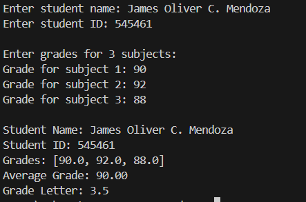
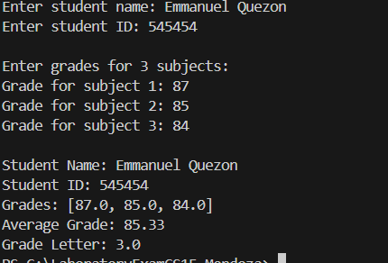

# LABORATORY EXAMINATION (Week 4 - 5)

## CS15 - Simple Student Grading System

### Project Description
- A program to track items in a small shop.

### Features
- Add student name and ID
- Record grades for 3 subjects
- Calculate and display average grade
- Get letter grade based on average

### OOP Concepts
- Class Student
- Methods; add_grades()
- calculate_average()
- display_info()
- get_grade_letter()

## Output

### Example 1

---
### Example 2

---
## Programmed By
**James Oliver C. Mendoza**

